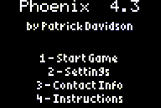

tihle (pronounced like "tile") is a freely usable emulator of the TI-83 Plus
graphing calculator, and maybe other calculators in the future.

**[Try the in-browser demo](https://taricorp.gitlab.io/tihle/)** to see what it
can do, [read more about why it exists](https://www.taricorp.net/2020/introducing-tihle/),
or continue on in this document to learn how to use or modify it.

## Usage

tihle currently supports loading 8xp program images, which get loaded into
RAM and executed directly. You can specify the path to a file on the command
line when launching it (`tihle phoenix.8xp`) or drag-and-drop a file onto
the display window after launching the emulator.

You can control logging by setting the `RUST_LOG` environment variable,
which can set what messages are printed to the console. A value like
`RUST_LOG=warn` will show only warnings and errors; refer to the [logging
library documentation](https://docs.rs/env_logger/0.7.1/env_logger/#enabling-logging)
for details.

### Key bindings

Not all of the calculator keys are currently bound to key bindings so you can
press them on your keyboard, but the basics are configured. The arrow keys are
mapped to the arrows on the calculator, <kbd>Shift</kbd> is <kbd>2nd</kbd>
and <kbd>Ctrl</kbd> is <kbd>Alpha</kbd>. Numbers, <kbd>+</kbd>, <kbd>-</kbd>
<kbd>*</kbd>, <kbd>/</kbd> and digits are mapped to the keyboard keys with
those labels (they're pretty obvious), as is <kbd>Enter</kbd> (or
<kbd>Return</kbd>) mapped to the calculator's enter key. <kbd>Backspace</kbd>
is mapped to <kbd>Clear</kbd>.

## Building

Compiling tihle requires a [Rust toolchain](https://www.rust-lang.org/),
C toolchain (for building the CPU core), and
[spasm](https://github.com/alberthdev/spasm-ng) (to build the OS image).

Use `cargo` to build the program; in the simplest form:

   cargo build --bins

will emit a binary to `target/debug/` that you can run.

You can also turn on features in some of the libraries that the program uses,
particularly around getting a copy of SDL. Unless you're developing tihle,
it may also be useful to create a release build with more optimizations
(though this compiles slower too). Try this invocation to make a binary
with no external dependency on SDL and optimizations:

    cargo build --bins --release --features=sdl2/static-link,sdl2/bundled

This binary will be output to `target/release`.
